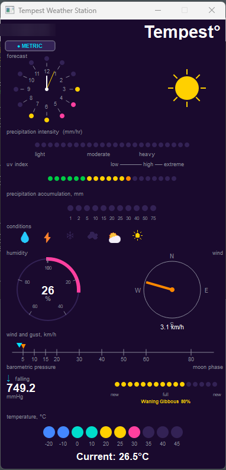

# Tempest Weather Station Display

A Python/PyQt5 desktop application that listens for UDP broadcasts from a [WeatherFlow Tempest](https://weatherflow.com/tempest-weather-system/) weather station and renders a real-time display inspired by the **LightMap Weather Station** panel design.

> **Design credit:** The layout, colour scheme, and dot-matrix style are inspired by the LightMap Tempest Weather Display — a beautifully crafted physical LED panel for the Tempest station.
> Visit [lightmaps.io](https://lightmaps.io/collections/lightmap-weather/products/tempest-weather-display?variant=50248344535319) to see the original hardware product.

---

## Screenshot



---

## Requirements

- Python 3.9 or later
- PyQt5
- A WeatherFlow Tempest weather station on your local network (broadcasting UDP on port 50222)

---

## Installation

### Option 1 — Automatic installer (Windows)

Run the included PowerShell installer. It will ask your permission before installing anything:

```powershell
powershell -ExecutionPolicy Bypass -File "install_tempest.ps1"
```

The installer will:
1. Check for Python 3.9+ and offer to download it from python.org if not found
2. Check for PyQt5 and install it via pip if needed
3. Optionally create a desktop shortcut

### Option 2 — Manual install

```bash
pip install PyQt5
python tempest_display.py
```

---

## Usage

```bash
python tempest_display.py
```

The display starts immediately with demo data. As soon as your Tempest station broadcasts a UDP packet it will switch to live data. The station serial number (e.g. `ST-00057478`) appears in the top-left corner once the first packet is received.

### Desktop shortcut

Click the **monitor icon** in the top-left corner (to the left of the station serial number) to create a desktop shortcut that launches TempestDot directly.

- The icon flashes **green** briefly on success, or **red** if the shortcut could not be created.
- The shortcut is placed on your Windows Desktop as **"Tempest Display.lnk"**.
- Requires Windows (uses PowerShell's `WScript.Shell` to create the `.lnk` file).

### Unit toggle

Press **M** or click the **● METRIC / ● IMPERIAL** button to switch between unit systems at any time.

| Measurement | Metric | Imperial |
|---|---|---|
| Temperature | °C | °F |
| Wind / Gust | km/h | mph |
| Pressure | mmHg | inHg |
| Precipitation | mm | inches |

---

## Display sections

| Section | What it shows |
|---|---|
| **Forecast clock** | Current time with clock hands; coloured dots around the face indicate hourly precipitation probability (yellow = moderate, pink = high) |
| **Weather icon** | Derived from UV index, solar radiation, and precipitation type |
| **Precipitation intensity** | Dot bar in three colour segments: cyan = light, yellow = moderate, pink = heavy |
| **UV index** | 20-dot colour-graded bar: green → yellow → orange → pink |
| **Precipitation accumulation** | Cyan dots showing total rainfall since last reset |
| **Conditions** | Icon row highlights the active condition: rain, thunder, snow, cloudy, partly cloudy, clear |
| **Humidity** | Pink arc gauge 0–100% with numeric readout |
| **Wind compass** | Orange needle points toward wind direction; speed shown below |
| **Wind & gust scale** | Cyan pointer = average wind, orange triangle = gust |
| **Barometric pressure** | Numeric value with rising/falling trend arrow |
| **Moon phase** | 16-dot bar showing position in the lunar cycle (new → full → new), with phase name and illumination % |
| **Temperature** | Colour-graded dot bar from cold blue through teal, yellow, to hot pink |

---

## Moon phase calculation

The lunar cycle fraction is derived from a verified new moon epoch (2024-01-11 11:57 UTC) and the precise synodic period of 29.530589 days:

```python
raw_frac = ((time.time() - known_new) % lunar_period) / lunar_period
illumination = (1 - cos(raw_frac × 2π)) / 2
```

Phase names are assigned from the cycle position:

| Cycle position | Phase name |
|---|---|
| 0 – 2.5% | New Moon |
| 2.5 – 25% | Waxing Crescent |
| 25 – 27.5% | First Quarter |
| 27.5 – 50% | Waxing Gibbous |
| 50 – 52.5% | Full Moon |
| 52.5 – 75% | Waning Gibbous |
| 75 – 77.5% | Third Quarter |
| 77.5 – 100% | Waning Crescent |

Accuracy is approximately ±1 day. For higher precision, replace the calculation with the `ephem` library (`pip install ephem`).

---

## Tempest UDP protocol

The Tempest broadcasts JSON packets on UDP port 50222. This app handles:

- `obs_st` — full observation (wind, temperature, humidity, pressure, UV, precipitation, etc.)
- `rapid_wind` — high-frequency wind updates (several per minute)
- `evt_precip` — precipitation start event

Field mapping follows the [WeatherFlow Tempest UDP Reference](https://weatherflow.github.io/Tempest/api/udp/v143/).

All values are stored internally in SI units (m/s, °C, hPa, mm) and converted to the chosen display unit system at render time.

---

## Files

| File | Purpose |
|---|---|
| `tempest_display.py` | Main application |
| `install_tempest.ps1` | Windows installer (Python + PyQt5 + optional desktop shortcut) |
| `README.md` | This file |
| `tempest_display-screenshot.png` | Screenshot shown above |

---

## License

This project is provided as-is for personal, non-commercial use. The dot-matrix display concept and visual design are the intellectual property of [LightMap](https://lightmaps.io). This software is an independent implementation and is not affiliated with, endorsed by, or supported by LightMap or WeatherFlow.
